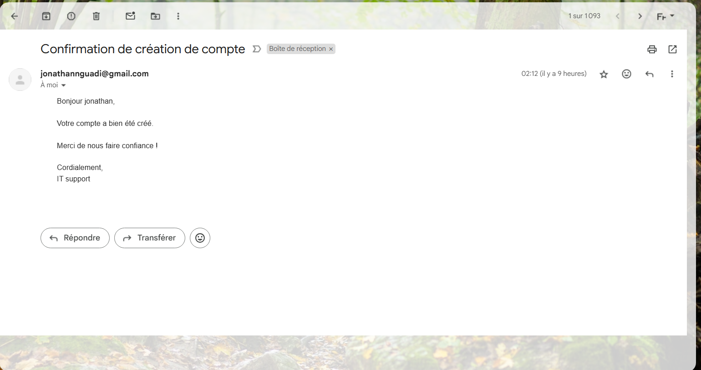

Gestionnaire de Comptes Utilisateurs avec Confirmation Email

Auteur: Jonathan Nguadi

Langage: Python 

Librairies utilisées: 

getpass

hashlib

smtplib

email.mime.text

email.mime.multipart

--------------------------------------------------------------------------------------------------------
Description

Ce projet est un gestionnaire de comptes utilisateurs simple en ligne de commande. Il permet à un utilisateur de :

Créer un compte avec un mot de passe sécurisé (haché avec SHA-256)

Se connecter avec vérification du mot de passe

Réinitialiser son mot de passe

Recevoir un email de confirmation après création du compte 

Fonctionnalités principales

🔐 Hachage du mot de passe avec hashlib

📬 Envoi automatique d’un email de bienvenue via Gmail SMTP

👤 Interface simple et interactive en ligne de commande

-----------------------------------------------------------

Menu proposé

1. Créer un compte

2. Se connecter

3. Réinitialiser le mot de passe

4. Quitter

------------------------------------------------------
Usage

1. Create account
2. Login
3. Reset password
4. Exit
Choose an option: 1
Your name: jonathan
Your password: ***********
Welcome jonathan, your password ends with ***123
-----------------------------------------------------------
Mail

-----------------------------------------------------------
Recommandations

Utiliser Python 3.10 ou plus récent

Créer un mot de passe Gmail pour application dans la section sécurité de ton compte Google
------------------------------------------------------------------------------------------

Améliorations possibles

Interface graphique avec Tkinter ou Flask

Ajout de logs d'activité ou tentatives de connexion

----------------------------------------------------
Merci d’avoir utilisé ce projet ❤️
Jonathan Nguadi

